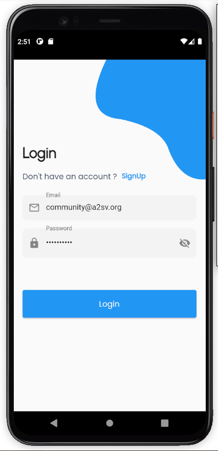
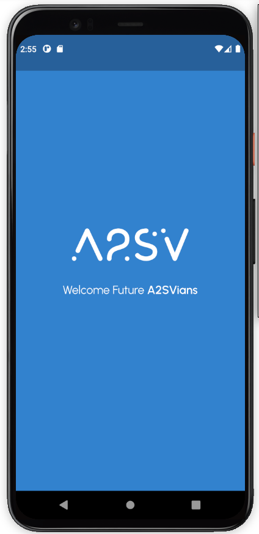
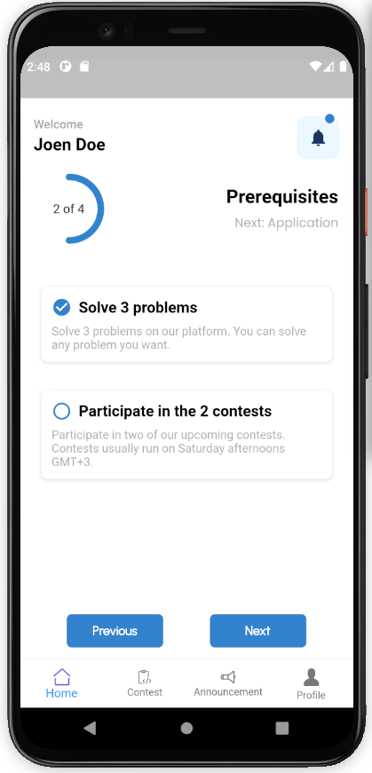
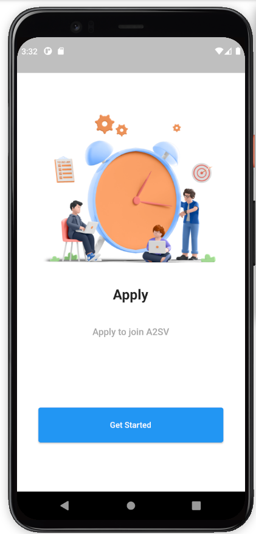
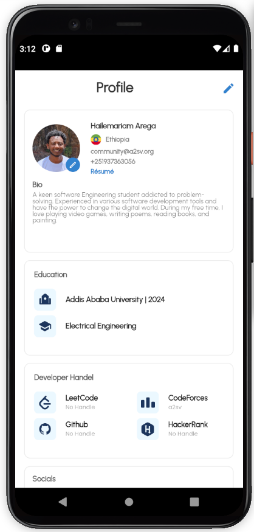
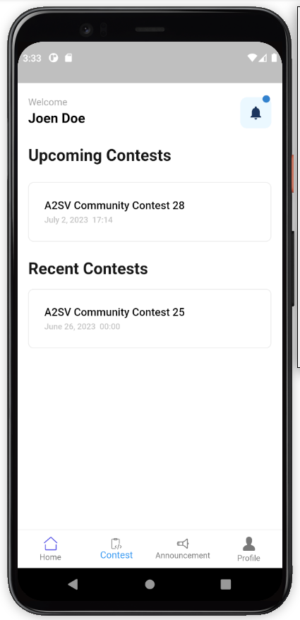
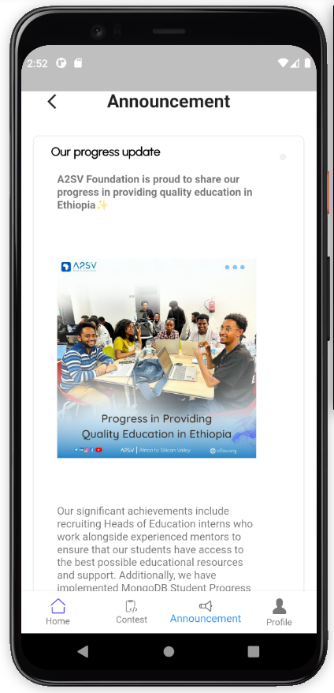

# A2SV Community Portal Mobile App

The A2SV Community Portal Mobile App is a centralized platform designed to address the challenges faced by community members and heads of the A2SV community program. The app aims to streamline the joining process, provide clear instructions, automate application management, and alleviate scalability issues. It serves as a comprehensive tool to enhance the efficiency and effectiveness of the A2SV community program.

## Problem

The A2SV community program has experienced significant growth in popularity, leading to challenges with its current management system. The use of Google Sheets and Telegram channels for managing new joiners and the application process has proven inefficient and difficult to scale. Key problems include:

1. Lack of clear instructions for new joiners
2. Manual work for heads of community
3. Performance issues under heavy load

## Solution

The A2SV Community Portal Mobile App offers a solution by providing a centralized platform that addresses the challenges faced by community members and heads of the community. The key features of the app include:

1. Learning Resource: The app provides learning materials to help new users, especially those unfamiliar with programming, get acquainted with the basics of programming.
2. Road Map: Users are guided through a clear step-by-step process to join the A2SV community education division system. Their progress is tracked, and they are prompted to complete the next required steps while monitoring their progress.
3. Application Management: The app manages new joiners by adding them to a waitlist and assigning them to a group when one becomes available.
4. Contest Creation and Result Tracking: Heads of the community education division can create weekly contests within the app and have access to detailed analysis and tracking of past contests.
5. Announcement System: The app serves as a communication channel between the head of community education and community members, allowing the head of education to create and distribute announcements.

## Plan

The A2SV Community Portal Mobile App is an essential tool in improving the efficiency of the A2SV community program. While the current focus of the project is on onboarding new members to the Community division, there are plans to expand the app in the future to encompass all activities related to community education.

This repository contains the codebase for the mobile app of the A2SV Community Portal. It is built using [insert technology/framework] and follows industry-standard coding practices.

## Installation and Setup

To run the A2SV Community Portal Mobile App locally, follow these steps:

1. Clone this repository.
2. Install Dependencies using `flutter pub get`
3. Configure the necessary environment variables.
4. Build and run the app using `flutter run`.
5. Access the app through the provided local URL.

Please refer to the https://docs.google.com/document/d/1ypS2BTEXU89lgpqg8xK75Td1pUW4yzH0aTpfGymk8Yg/edit for detailed instructions on installation, setup, and usage.

## Contributing

We welcome contributions from the community to enhance the A2SV Community Portal Mobile App. To contribute, please follow these steps:

1. Fork this repository.
2. Create a new branch for your feature/bug fix.
3. Make the necessary changes and commit them.
4. Push your changes to your forked repository.
5. Submit a pull request, explaining the changes you have made.

## Contact Us

If you have any questions, suggestions, or feedback, please contact the A2SV community team at @a2sv_community_official

We appreciate your interest and involvement in the A2SV Community Portal Mobile App. Together, we can make the A2SV community program even more impactful and scalable!
